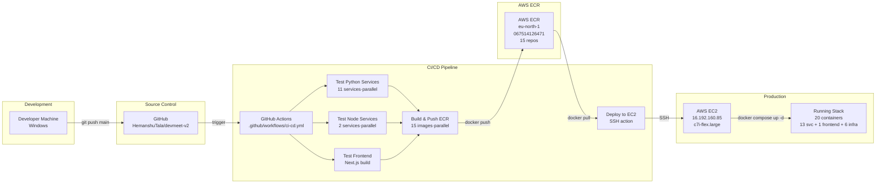

# 01 — High-Level Design: System Architecture
**Document Number:** DevMeet-HLD-001  
**Version:** 2.0  
**Date:** 2026-08-02  
**Status:** Production  
**Classification:** Internal Technical  
**IEEE Standard Reference:** IEEE 1016-2009 (Software Design Description)

---

## 1. System Identification

| Attribute | Value |
|-----------|-------|
| System Name | DevMeet v2.0 — AI-Powered Mock Interview Platform |
| Deployment Region | AWS eu-north-1 (Stockholm) |
| Production Host | EC2 `c7i-flex.large` — IP `16.192.160.85` |
| Container Registry | AWS ECR `067514126471.dkr.ecr.eu-north-1.amazonaws.com` |
| Object Storage | AWS S3 bucket `aakruti-s3` (eu-north-1) |
| Email | AWS SES eu-north-1 — from `hemansutala8@gmail.com` |
| Repository | `github.com/HemanshuTala/devmeet-v2` |
| CI/CD | GitHub Actions → ECR → EC2 SSH deploy |

---

## 2. Architecture Overview

### 2.1 System Description

DevMeet is a **microservices platform** deployed on AWS EC2 using Docker Compose. All 13 backend services run as Docker containers behind an NGINX API gateway. The frontend is a Next.js 14 application running as a separate container on the same host.

### 2.2 Architectural Diagram

```mermaid
graph TB
    subgraph "External Actors"
        EU[End User<br/>Browser]
        ADM[Admin<br/>Browser]
        GC[Groq Cloud<br/>LLM API]
        LK[LiveKit<br/>WebRTC]
        RZ[Razorpay<br/>Payments]
    end
    
    subgraph "AWS EC2 c7i-flex.large<br/>eu-north-1<br/>16.192.160.85"
        subgraph "Presentation Layer"
            FE[Next.js 14 Frontend<br/>:3000<br/>TypeScript·TailwindCSS·Zustand<br/>Monaco Editor·LiveKit SDK·TensorFlow.js]
        end
        
        subgraph "API Gateway Layer"
            GW[NGINX API Gateway<br/>:80/:8000<br/>Rate limiting·CORS·Routing<br/>Security headers]
        end
        
        subgraph "Microservices Layer"
            AUTH[Auth Service<br/>:8001<br/>FastAPI/Python]
            USER[User Service<br/>:8002<br/>FastAPI/Python]
            ORCH[Orchestrator Service<br/>:8003<br/>FastAPI/Python]
            AI[AI Interviewer Service<br/>:8004<br/>FastAPI/Python]
            CODE[Code Execution Service<br/>:8005<br/>FastAPI/Python·Docker-in-Docker]
            VIDEO[Video Service<br/>:8006<br/>Node.js·LiveKit SDK]
            FB[Feedback Service<br/>:8007<br/>FastAPI/Python·WeasyPrint]
            NOTIF[Notification Service<br/>:8008<br/>Node.js·SES·WebSocket]
            ANALYT[Analytics Service<br/>:8009<br/>FastAPI/Python]
            ADMIN[Admin Service<br/>:8010<br/>FastAPI/Python]
            FILE[File Service<br/>:8011<br/>FastAPI/Python·S3]
            PAY[Payment Service<br/>:8012<br/>FastAPI/Python·Razorpay]
            SEARCH[Search Service<br/>:8013<br/>FastAPI/Python·Elasticsearch]
        end
        
        subgraph "Data Layer"
            PG[PostgreSQL 16<br/>:5432<br/>Primary relational store]
            REDIS[Redis 7.2<br/>:6379<br/>Cache·Pub/Sub]
            RMQ[RabbitMQ 3.12<br/>:5672<br/>Task queues]
            KAFKA[Kafka 3.6<br/>:9092<br/>Event streaming]
            ES[Elasticsearch 8.11<br/>:9200<br/>Full-text search]
        end
    end
    
    subgraph "AWS Managed Services"
        S3[AWS S3<br/>eu-north-1<br/>aakruti-s3<br/>Avatars·PDFs·Code snapshots]
        SES[AWS SES<br/>eu-north-1<br/>Transactional email]
        ECR[AWS ECR<br/>eu-north-1<br/>Container registry<br/>14 repos]
    end
    
    EU -->|HTTPS:443/:80| GW
    ADM -->|HTTPS:443/:80| GW
    GW -->|HTTP| FE
    GW -->|routes| AUTH
    GW -->|routes| USER
    GW -->|routes| ORCH
    GW -->|routes| AI
    GW -->|routes| CODE
    GW -->|routes| VIDEO
    GW -->|routes| FB
    GW -->|routes| NOTIF
    GW -->|routes| ANALYT
    GW -->|routes| ADMIN
    GW -->|routes| FILE
    GW -->|routes| PAY
    GW -->|routes| SEARCH
    
    AUTH --> PG
    AUTH --> REDIS
    USER --> PG
    ORCH --> PG
    ORCH --> RMQ
    ORCH --> KAFKA
    AI --> GC
    VIDEO --> LK
    FB --> GC
    FB --> S3
    FB --> RMQ
    NOTIF --> RMQ
    NOTIF --> SES
    ANALYT --> KAFKA
    ANALYT --> PG
    ADMIN --> PG
    FILE --> S3
    PAY --> RZ
    SEARCH --> ES
```



```
┌─────────────────────────────────────────────────────────────────────────────────┐
│                              EXTERNAL ACTORS                                     │
│                                                                                  │
│  ┌─────────────┐  ┌─────────────┐  ┌──────────────┐  ┌─────────┐  ┌─────────┐ │
│  │  End User   │  │    Admin    │  │  Groq Cloud  │  │LiveKit  │  │Razorpay │ │
│  │  (Browser)  │  │  (Browser)  │  │  LLM API     │  │WebRTC   │  │Payments │ │
│  └──────┬──────┘  └──────┬──────┘  └──────┬───────┘  └────┬────┘  └────┬────┘ │
└─────────┼────────────────┼────────────────┼────────────────┼────────────┼──────┘
          │ HTTPS :443/:80  │                │ HTTPS          │ WSS        │ HTTPS
          ▼                 ▼                │                │            │
┌─────────────────────────────────────────────────────────────────────────────────┐
│                     AWS EC2  c7i-flex.large  (eu-north-1)                       │
│                     Public IP: 16.192.160.85                                     │
│                                                                                  │
│  ┌──────────────────────────────────────────────────────────────────────────┐   │
│  │  PRESENTATION LAYER                                                       │   │
│  │                                                                           │   │
│  │  ┌────────────────────────────────────────────────────────────────────┐  │   │
│  │  │  «container» Next.js 14 Frontend  :3000                            │  │   │
│  │  │  TypeScript · TailwindCSS · Zustand · TanStack Query               │  │   │
│  │  │  Monaco Editor · LiveKit SDK · TensorFlow.js (AI Proctoring)       │  │   │
│  │  │  Image: ECR/devmeet-frontend:latest                                │  │   │
│  │  └────────────────────────────────────────────────────────────────────┘  │   │
│  └──────────────────────────────────────────────────────────────────────────┘   │
│                                    │ HTTP                                         │
│                                    ▼                                              │
│  ┌──────────────────────────────────────────────────────────────────────────┐   │
│  │  API GATEWAY LAYER                                                        │   │
│  │                                                                           │   │
│  │  ┌────────────────────────────────────────────────────────────────────┐  │   │
│  │  │  «component» NGINX API Gateway  :80  (:8000 internal)              │  │   │
│  │  │  • Rate limiting: 30 req/s general · 5 req/min auth · 10/min code  │  │   │
│  │  │  • CORS: allows frontend origin                                     │  │   │
│  │  │  • Routes /api/v1/* to respective microservice                      │  │   │
│  │  │  • Security headers: X-Frame-Options, X-XSS-Protection             │  │   │
│  │  │  Image: ECR/devmeet-api-gateway:latest                             │  │   │
│  │  └────────────────────────────────────────────────────────────────────┘  │   │
│  └──────────────────────────────────────────────────────────────────────────┘   │
│              │ routes to internal Docker network (devmeet_net)                    │
│              ▼                                                                    │
│  ┌──────────────────────────────────────────────────────────────────────────┐   │
│  │  MICROSERVICES LAYER  (Docker network: devmeet_net)                       │   │
│  │                                                                           │   │
│  │  ┌─────────────┐ ┌─────────────┐ ┌──────────────────┐ ┌──────────────┐ │   │
│  │  │Auth :8001   │ │User :8002   │ │Orchestrator :8003│ │AI Intvw:8004│ │   │
│  │  │FastAPI/Py   │ │FastAPI/Py   │ │FastAPI/Python    │ │FastAPI/Py   │ │   │
│  │  └─────────────┘ └─────────────┘ └──────────────────┘ └──────┬───────┘ │   │
│  │                                                                │ Groq API│   │
│  │  ┌─────────────┐ ┌─────────────┐ ┌──────────────────┐        │         │   │
│  │  │CodeExec:8005│ │Video :8006  │ │Feedback  :8007   │        │         │   │
│  │  │FastAPI/Py   │ │Node.js      │ │FastAPI/Python    │        │         │   │
│  │  │Docker-in-D  │ │LiveKit SDK  │ │WeasyPrint+Groq   │        │         │   │
│  │  └─────────────┘ └──────┬──────┘ └──────────────────┘        │         │   │
│  │                         │ LiveKit                              │         │   │
│  │  ┌─────────────┐ ┌─────────────┐ ┌──────────────────┐ ┌──────────────┐ │   │
│  │  │Notif :8008  │ │Analyt:8009  │ │Admin     :8010   │ │File  :8011  │ │   │
│  │  │Node.js+SES  │ │FastAPI/Py   │ │FastAPI/Python    │ │FastAPI+S3   │ │   │
│  │  └─────────────┘ └─────────────┘ └──────────────────┘ └──────┬───────┘ │   │
│  │                                                                │ S3      │   │
│  │  ┌─────────────┐ ┌─────────────┐                              │         │   │
│  │  │Payment:8012 │ │Search :8013 │                              │         │   │
│  │  │FastAPI/Py   │ │FastAPI+ES   │                              │         │   │
│  │  │Razorpay SDK │ └─────────────┘                              │         │   │
│  │  └─────────────┘                                              │         │   │
│  └──────────────────────────────────────────────────────────────────────────┘   │
│              │                                                                    │
│              ▼                                                                    │
│  ┌──────────────────────────────────────────────────────────────────────────┐   │
│  │  DATA LAYER  (Docker network: devmeet_net)                                │   │
│  │                                                                           │   │
│  │  ┌───────────────┐ ┌────────────┐ ┌────────────────┐ ┌────────────────┐ │   │
│  │  │«db»           │ │«cache»     │ │«broker»        │ │«stream»        │ │   │
│  │  │PostgreSQL 16  │ │Redis 7.2   │ │RabbitMQ 3.12   │ │Kafka 3.6       │ │   │
│  │  │:5432          │ │:6379       │ │:5672           │ │:9092           │ │   │
│  │  └───────────────┘ └────────────┘ └────────────────┘ └────────────────┘ │   │
│  │                                                                           │   │
│  │  ┌───────────────┐                                                        │   │
│  │  │«search»       │                                                        │   │
│  │  │Elasticsearch  │                                                        │   │
│  │  │8.11 :9200     │                                                        │   │
│  │  └───────────────┘                                                        │   │
│  └──────────────────────────────────────────────────────────────────────────┘   │
└─────────────────────────────────────────────────────────────────────────────────┘
          │                    │                   │
          ▼                    ▼                   ▼
┌──────────────┐    ┌──────────────────┐   ┌──────────────────┐
│  AWS S3      │    │  AWS SES         │   │  AWS ECR         │
│  eu-north-1  │    │  eu-north-1      │   │  eu-north-1      │
│  aakruti-s3  │    │  from:           │   │  067514126471    │
│  • avatars   │    │  hemansutala8    │   │  14 repos        │
│  • PDFs      │    │  @gmail.com      │   │  (one per svc)   │
│  • code snap │    └──────────────────┘   └──────────────────┘
└──────────────┘
```

---

## 3. Layer-by-Layer Description

### 3.1 External Actors

| Actor | Type | Protocol | Purpose |
|-------|------|----------|---------|
| End User | Human | HTTPS browser | Uses DevMeet for mock interviews |
| Admin | Human | HTTPS browser | Manages platform via Admin Service |
| Groq Cloud | External SaaS | HTTPS REST | LLM inference — LLaMA 3 70B, Mixtral 8x7B, Whisper |
| LiveKit Cloud | External SaaS | WSS | WebRTC TURN/STUN for video interviews |
| Razorpay | External SaaS | HTTPS REST + Webhooks | Subscription payment processing |
| AWS S3 | AWS Managed | HTTPS (AWS SDK) | Object storage for files and PDFs |
| AWS SES | AWS Managed | HTTPS (AWS SDK) | Transactional email delivery |
| AWS ECR | AWS Managed | HTTPS (Docker) | Container image registry |

---

### 3.2 Presentation Layer

**Next.js 14 Frontend** (Container: `devmeet-frontend`, Port 3000)

| Component | Library | Purpose |
|-----------|---------|---------|
| UI Framework | Next.js 14, React 18, TypeScript | App shell, routing, SSR |
| Styling | TailwindCSS 3.4, Radix UI | Component styling |
| State Management | Zustand 4.5 | Global UI state |
| Server State | TanStack Query 5 | API data fetching + caching |
| Code Editor | Monaco Editor 0.45 (VS Code engine) | Code writing during DSA interviews |
| Video | LiveKit Client 2.4 | WebRTC video/audio in interview room |
| AI Proctoring | TensorFlow.js, MediaPipe | Face detection, tab-switch detection |
| Charts | Recharts 2.10 | Score trends, analytics dashboard |
| Animations | Framer Motion 12, GSAP 3.15 | Page transitions |

**Environment variables (build-time baked in):**
```
NEXT_PUBLIC_GATEWAY_URL = http://16.192.160.85
NEXT_PUBLIC_API_URL     = http://16.192.160.85
NEXT_PUBLIC_NOTIF_WS_URL = ws://16.192.160.85
```

---

### 3.3 API Gateway Layer

**NGINX** (Container: `devmeet-api-gateway`, Port 80/8000)

The single entry point for all HTTP traffic. Key responsibilities:

| Responsibility | Config |
|---------------|--------|
| Rate limiting | 30 req/s general, 5 req/min auth login, 10 req/min code exec, 20 req/min AI interview |
| CORS | Allows `localhost:*` and the frontend origin dynamically via map |
| Request routing | `/api/v1/auth/*` → auth-service:8001, `/api/v1/sessions/*` → orchestrator:8003, etc. |
| Security headers | `X-Content-Type-Options: nosniff`, `X-Frame-Options: DENY`, `X-XSS-Protection: 1; mode=block` |
| Health check | `GET /health` returns `{"status":"ok","service":"api-gateway"}` |
| Body size limit | `client_max_body_size 10m` |
| Timeouts | Connect 10s, Read 60s, Send 30s |

---

### 3.4 Microservices Layer

All 13 services run as Docker containers on the `devmeet_net` bridge network. They are not exposed on public ports — all external access goes through NGINX on port 80.

| Service | Port | Runtime | Image in ECR |
|---------|------|---------|-------------|
| auth-service | 8001 | Python 3.11 / FastAPI | `devmeet-auth-service:latest` |
| user-service | 8002 | Python 3.11 / FastAPI | `devmeet-user-service:latest` |
| orchestrator-service | 8003 | Python 3.11 / FastAPI | `devmeet-orchestrator-service:latest` |
| ai-interviewer-service | 8004 | Python 3.11 / FastAPI | `devmeet-ai-interviewer-service:latest` |
| code-execution-service | 8005 | Python 3.11 / FastAPI | `devmeet-code-execution-service:latest` |
| video-service | 8006 | Node.js 20 | `devmeet-video-service:latest` |
| feedback-service | 8007 | Python 3.11 / FastAPI | `devmeet-feedback-service:latest` |
| notification-service | 8008 | Node.js 20 | `devmeet-notification-service:latest` |
| analytics-service | 8009 | Python 3.11 / FastAPI | `devmeet-analytics-service:latest` |
| admin-service | 8010 | Python 3.11 / FastAPI | `devmeet-admin-service:latest` |
| file-service | 8011 | Python 3.11 / FastAPI | `devmeet-file-service:latest` |
| payment-service | 8012 | Python 3.11 / FastAPI | `devmeet-payment-service:latest` |
| search-service | 8013 | Python 3.11 / FastAPI | `devmeet-search-service:latest` |

---

### 3.5 Data Layer

| Store | Container | Port | Volume | Purpose |
|-------|-----------|------|--------|---------|
| PostgreSQL 16 | `devmeet-postgres-1` | 5432 | `postgres_data` | Primary relational database |
| Redis 7.2 | `devmeet-redis-1` | 6379 | `redis_data` | JWT tokens, rate limits, pub/sub |
| RabbitMQ 3.12 | `devmeet-rabbitmq-1` | 5672 | `rabbitmq_data` | Task queues (feedback, notifications) |
| Kafka 3.6 | `devmeet-kafka-1` | 9092 | `kafka_data` | Analytics event streaming |
| Zookeeper 3.5 | `devmeet-zookeeper-1` | 2181 | `zookeeper_data` | Kafka coordination |
| Elasticsearch 8.11 | `devmeet-elasticsearch-1` | 9200 | `elasticsearch_data` | Question bank full-text search |

---

### 3.6 AWS Managed Services

| Service | Region | Resource | Used by |
|---------|--------|----------|---------|
| S3 | eu-north-1 | `aakruti-s3` | file-service (avatars, uploads), feedback-service (PDFs), code-execution-service (snapshots) |
| SES | eu-north-1 | From: `hemansutala8@gmail.com` | notification-service (welcome emails, feedback ready) |
| ECR | eu-north-1 | 14 repos under `067514126471` | All Docker image storage and CI/CD pulls |

---

## 4. Key System Flows

### 4.1 Authentication Flow
```
User (Browser)
  → POST /api/v1/auth/login  (NGINX :80)
  → auth-service :8001
  → SELECT from PostgreSQL users table
  → bcrypt password verify
  → Generate JWT (HS256, 60 min access + 7 day refresh)
  → Store refresh token hash in Redis (TTL 7 days)
  → Return {access_token, refresh_token}
```

### 4.2 AI Interview Flow
```
User (Browser)
  → POST /api/v1/sessions  (NGINX :80)
  → orchestrator-service :8003
  → INSERT session in PostgreSQL
  → Return session_id

  → GET /api/v1/interview/question/stream?session_id=X  (SSE)
  → ai-interviewer-service :8004
  → Fetch conversation history from PostgreSQL
  → Build prompt with session context
  → POST to Groq Cloud API (LLaMA 3 70B / Mixtral)
  → Stream tokens back via SSE to browser
```

### 4.3 Post-Session Feedback Pipeline
```
User (Browser)
  → POST /api/v1/sessions/{id}/complete
  → orchestrator-service :8003
  → UPDATE sessions SET status='completed' in PostgreSQL
  → INSERT outbox_events (atomic, same transaction)
  → Background poller picks up outbox_events
  → Publish session.completed → RabbitMQ

  → feedback-service :8007 consumes session.completed
  → Fetch all turns + code from PostgreSQL
  → Call Groq Cloud for scoring (6 dimensions)
  → Generate HTML via Jinja2
  → Render PDF via WeasyPrint
  → Upload PDF to S3 aakruti-s3
  → INSERT feedback_reports in PostgreSQL
  → Publish feedback.generated → RabbitMQ

  → notification-service :8008 consumes feedback.generated
  → Send email via AWS SES
  → Push WebSocket notification to user
```

### 4.4 File Upload Flow
```
User (Browser)
  → POST /api/v1/files/upload  (multipart/form-data)
  → NGINX :80 (10 MB limit)
  → file-service :8011
  → Upload to S3 aakruti-s3 via boto3
  → Return {url: "https://aakruti-s3.s3.eu-north-1.amazonaws.com/..."}
  → Store URL in PostgreSQL user_profiles.avatar_url
```

### 4.5 Code Execution Flow
```
User (Browser)
  → POST /api/v1/execute  {language: "python", code: "..."}
  → NGINX :80 (rate limit: 10/min)
  → code-execution-service :8005
  → Spawn Docker container (python:3.11-slim)
    flags: --network=none --memory=512m --cpus=0.5
           --pids-limit=64 --read-only --timeout=10s
  → Execute code
  → Capture stdout/stderr
  → Remove container
  → Upload snapshot to S3 aakruti-s3 (if session_id provided)
  → Return {success, output, execution_time, exit_code}
```

---

## 5. Non-Functional Characteristics

| Characteristic | Target | Implementation |
|---------------|--------|---------------|
| Availability | 99.5% | Docker restart policies (`unless-stopped`) |
| API Latency P95 | < 500 ms | Redis caching, NGINX proxy_read_timeout 60s |
| AI Response Start | < 3 s | Groq Cloud LLM inference, SSE streaming |
| Code Execution | < 10 s | Docker sandbox with 10s timeout |
| Concurrent Sessions | 50+ (current instance) | Single EC2 host, scale vertically |
| Security | OWASP Top 10 | JWT auth, rate limiting, Docker isolation, parameterized queries |

---

## 6. Deployment Topology

### 6.1 CI/CD Pipeline Diagram



### 6.2 Deployment Steps

1. **Developer pushes code** to GitHub main branch
2. **GitHub Actions triggers** CI/CD pipeline
3. **Parallel testing** of all services (11 Python, 2 Node, 1 Frontend)
4. **Build and push** 15 Docker images to AWS ECR (eu-north-1)
5. **SSH deploy** to EC2 instance (16.192.160.85)
6. **Pull images** and restart containers via Docker Compose
7. **Health check** verifies API gateway is responding
