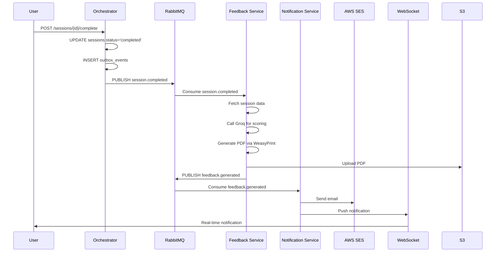
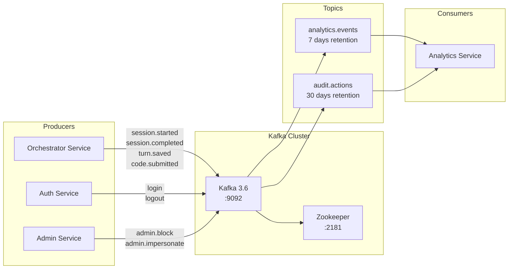

# 02 — Low-Level Design: Microservices Interaction
**Document Number:** DevMeet-LLD-002  
**Version:** 2.0  
**Date:** 2026-08-02  
**Status:** Production  
**Classification:** Internal Technical  
**IEEE Standard Reference:** IEEE 1016-2009 (Software Design Description)

---

## 1. Purpose

This document describes every microservice in DevMeet v2.0 — the APIs each exposes, the services each calls, the data stores each owns, and the asynchronous message flows between them. It is the authoritative reference for inter-service communication.

---

## 2. Service Interaction Map

### 2.1 Service Interaction Diagram

```mermaid
graph TB
    subgraph "API Gateway"
        GW[NGINX API Gateway<br/>:80/:8000<br/>Routes /api/v1/*]
    end
    
    subgraph "Identity & Support Services"
        AUTH[Auth Service<br/>:8001<br/>JWT·OAuth·MFA]
        USER[User Service<br/>:8002<br/>Profile·Quota]
        ADMIN[Admin Service<br/>:8010<br/>User management]
        PAY[Payment Service<br/>:8012<br/>Razorpay]
        NOTIF[Notification Service<br/>:8008<br/>Email·WebSocket]
    end
    
    subgraph "Interview Pipeline"
        ORCH[Orchestrator Service<br/>:8003<br/>Session management]
        AI[AI Interviewer Service<br/>:8004<br/>Groq LLM]
        CODE[Code Execution Service<br/>:8005<br/>Docker sandbox]
        VIDEO[Video Service<br/>:8006<br/>LiveKit WebRTC]
        FB[Feedback Service<br/>:8007<br/>PDF generation]
    end
    
    subgraph "Data & Analytics"
        ANALYT[Analytics Service<br/>:8009<br/>Kafka consumer]
        FILE[File Service<br/>:8011<br/>S3 integration]
        SEARCH[Search Service<br/>:8013<br/>Elasticsearch]
    end
    
    subgraph "Data Stores"
        PG[PostgreSQL 16<br/>:5432]
        REDIS[Redis 7.2<br/>:6379]
        RMQ[RabbitMQ 3.12<br/>:5672]
        KAFKA[Kafka 3.6<br/>:9092]
        ES[Elasticsearch 8.11<br/>:9200]
    end
    
    subgraph "External Services"
        GROQ[Groq Cloud<br/>LLM API]
        LIVEKIT[LiveKit Cloud<br/>WebRTC]
        S3[AWS S3<br/>aakruti-s3]
        SES[AWS SES<br/>Email]
        RAZORPAY[Razorpay<br/>Payments]
    end
    
    GW -->|/api/v1/auth/*| AUTH
    GW -->|/api/v1/users/*| USER
    GW -->|/api/v1/admin/*| ADMIN
    GW -->|/api/v1/payments/*| PAY
    GW -->|/api/v1/notifications/*| NOTIF
    GW -->|/api/v1/sessions/*| ORCH
    GW -->|/api/v1/interview/*| AI
    GW -->|/api/v1/execute| CODE
    GW -->|/api/v1/video/*| VIDEO
    GW -->|/api/v1/feedback/*| FB
    GW -->|/api/v1/analytics/*| ANALYT
    GW -->|/api/v1/files/*| FILE
    GW -->|/api/v1/search/*| SEARCH
    
    AUTH --> PG
    AUTH --> REDIS
    USER --> PG
    USER --> REDIS
    ORCH --> PG
    ORCH --> RMQ
    ORCH --> KAFKA
    AI --> GROQ
    CODE --> S3
    VIDEO --> LIVEKIT
    FB --> GROQ
    FB --> S3
    FB --> RMQ
    NOTIF --> RMQ
    NOTIF --> SES
    NOTIF --> REDIS
    ANALYT --> KAFKA
    ANALYT --> PG
    ADMIN --> PG
    FILE --> S3
    PAY --> RAZORPAY
    SEARCH --> ES
```



---

## 3. Service Specifications

### 3.1 Auth Service `:8001`
**Runtime:** Python 3.11 / FastAPI  
**Image:** `ECR/devmeet-auth-service:latest`  
**Owns:** `users`, `login_history`, `login_attempts`, `password_resets`, `mfa_configs`, `oauth_accounts`, `audit_logs` tables

#### APIs Exposed

| Method | Path | Auth Required | Description |
|--------|------|--------------|-------------|
| POST | `/api/v1/auth/register` | No | Create new account. Hashes password with bcrypt (cost 12). Returns JWT pair. |
| POST | `/api/v1/auth/login` | No | Authenticate. Checks lockout (5 fails = 15 min lock). Returns access + refresh tokens. |
| POST | `/api/v1/auth/refresh` | Refresh token | Exchange refresh token for new access token. Validates Redis hash. |
| POST | `/api/v1/auth/logout` | JWT | Revoke refresh token from Redis. |
| POST | `/api/v1/auth/logout-all` | JWT | Revoke all refresh tokens for user. |
| GET | `/api/v1/auth/me` | JWT | Return current user info from token. |
| POST | `/api/v1/auth/forgot-password` | No | Send reset email via SES. Stores token in Redis (TTL 1h). |
| POST | `/api/v1/auth/reset-password` | Reset token | Validate token, update password hash. |
| GET | `/api/v1/auth/oauth/google` | No | Redirect to Google OAuth2. |
| GET | `/api/v1/auth/oauth/github` | No | Redirect to GitHub OAuth2. |
| GET | `/api/v1/auth/oauth/callback` | OAuth state | Handle OAuth callback, create/link account, return JWT. |
| POST | `/api/v1/auth/mfa/setup` | JWT | Generate TOTP secret, return QR URI. |
| POST | `/api/v1/auth/mfa/verify` | JWT + TOTP | Verify TOTP code and enable MFA. |
| POST | `/api/v1/auth/mfa/login` | JWT (pre-MFA) | Complete login with TOTP code. |
| GET | `/api/v1/auth/verify-admin` | JWT | Internal: verify admin role for NGINX auth_request. |

#### Data Store Usage
```
PostgreSQL:
  READ  — users (login check, profile lookup)
  WRITE — users (register, password update)
  WRITE — login_history (every login attempt)
  WRITE — login_attempts (failed attempt counter)
  WRITE — password_resets (token storage)
  WRITE — mfa_configs (TOTP secret + status)
  WRITE — oauth_accounts (OAuth link)
  WRITE — audit_logs (all auth events)

Redis:
  WRITE — refresh:{token_hash} TTL 7d  (refresh token storage)
  READ  — refresh:{token_hash}          (token validation)
  DEL   — refresh:{token_hash}          (logout / revoke)
  INCR  — ratelimit:{ip}:login TTL 60s  (rate limiting)
  WRITE — mfa_pending:{user_id} TTL 10m (MFA flow state)
```

#### JWT Configuration
```
Algorithm:  HS256
Secret:     JWT_SECRET_KEY (from .env)
Access TTL: 60 minutes
Refresh TTL: 7 days
Payload:    {user_id, email, role, plan}
```

---

### 3.2 User Service `:8002`
**Runtime:** Python 3.11 / FastAPI  
**Image:** `ECR/devmeet-user-service:latest`  
**Owns:** `user_profiles`, `user_plans`, `usage_quotas` tables  
**Calls:** auth-service (JWT verify), file-service (avatar upload)

#### APIs Exposed

| Method | Path | Auth Required | Description |
|--------|------|--------------|-------------|
| GET | `/api/v1/users/me` | JWT | Get own profile |
| PUT | `/api/v1/users/me` | JWT | Update name, bio, preferences |
| GET | `/api/v1/users/me/quota` | JWT | Remaining daily/monthly sessions |
| GET | `/api/v1/users/me/plan` | JWT | Current subscription plan details |
| POST | `/api/v1/users/me/avatar` | JWT | Upload profile picture (proxied to file-service) |
| GET | `/api/v1/users/leaderboard` | JWT | Top 50 users by score and completed sessions |
| GET | `/api/v1/users/{id}` | JWT (admin) | Get any user profile |
| PUT | `/api/v1/users/{id}/plan` | JWT (admin) | Update user's subscription plan |

#### Quota Logic
```
Free plan:    5 sessions/day,  30 sessions/month
Pro plan:     20 sessions/day, 200 sessions/month
Enterprise:   unlimited

Quota check: SELECT FROM usage_quotas WHERE user_id=$1 AND date=TODAY
             If row missing → INSERT with 0 count
             If count >= limit → 429 Too Many Requests
Quota incr:  Called by Orchestrator on session.start
```

---

### 3.3 Orchestrator Service `:8003`
**Runtime:** Python 3.11 / FastAPI  
**Image:** `ECR/devmeet-orchestrator-service:latest`  
**Owns:** `sessions`, `conversation_turns`, `code_submissions`, `outbox_events` tables  
**Calls:** auth-service, user-service (quota), ai-interviewer-service  
**Publishes:** `session.completed` → RabbitMQ, analytics events → Kafka

#### APIs Exposed

| Method | Path | Auth Required | Description |
|--------|------|--------------|-------------|
| POST | `/api/v1/sessions` | JWT | Create new session. Checks quota. Returns session_id. |
| GET | `/api/v1/sessions` | JWT | List user's sessions with pagination |
| GET | `/api/v1/sessions/{id}` | JWT | Get session details and status |
| POST | `/api/v1/sessions/{id}/start` | JWT | Begin interview timer. Status: pending → in_progress |
| POST | `/api/v1/sessions/{id}/pause` | JWT | Pause timer. |
| POST | `/api/v1/sessions/{id}/resume` | JWT | Resume timer. |
| POST | `/api/v1/sessions/{id}/complete` | JWT | End session. Triggers feedback pipeline. |
| POST | `/api/v1/sessions/{id}/heartbeat` | JWT | Keep-alive ping (every 30s). Sessions without heartbeat for 10min → auto-cancelled. |
| POST | `/api/v1/sessions/{id}/turns` | JWT | Save a conversation turn (user message or AI response). |
| POST | `/api/v1/sessions/{id}/code` | JWT | Save a code submission with language and test results. |
| GET | `/api/v1/sessions/{id}/turns` | JWT | Retrieve all conversation turns for a session. |

#### Session State Machine
```
                    ┌─────────┐
                    │ pending │  ← created by POST /sessions
                    └────┬────┘
                         │ POST /sessions/{id}/start
                    ┌────▼────────┐
                    │ in_progress │  ← heartbeat required every 30s
                    └────┬────────┘
              ┌──────────┼──────────┐
              │          │          │
         /pause      /complete  no heartbeat
              │          │       for 10 min
         ┌────▼──┐  ┌────▼──────┐  │
         │paused │  │ completed │  │
         └───┬───┘  └───────────┘  │
             │ /resume         ┌───▼──────┐
             └────────────────►│cancelled │
                                └──────────┘
```

#### On Session Complete (Transactional Outbox)
```sql
BEGIN;
  UPDATE sessions SET status='completed', completed_at=NOW() WHERE id=$1;
  INSERT INTO outbox_events (event_type, payload)
    VALUES ('session.completed', '{"session_id": "...", "user_id": "..."}');
COMMIT;
-- Background poller publishes to RabbitMQ, marks outbox row processed
```

---

### 3.4 AI Interviewer Service `:8004`
**Runtime:** Python 3.11 / FastAPI  
**Image:** `ECR/devmeet-ai-interviewer-service:latest`  
**Calls:** Groq Cloud API (LLaMA 3 70B, Mixtral 8x7B, Whisper)

#### APIs Exposed

| Method | Path | Auth Required | Description |
|--------|------|--------------|-------------|
| GET | `/api/v1/interview/question/stream` | JWT | SSE stream. Sends AI question tokens in real-time. |
| POST | `/api/v1/interview/hint` | JWT | Returns a hint without revealing the full answer. |
| POST | `/api/v1/interview/transcribe` | JWT | Accepts audio file, returns text transcript via Groq Whisper. |
| POST | `/api/v1/interview/evaluate` | JWT (internal) | Score a single answer. Used by Feedback Service. |

#### LLM Model Selection
```
interview_type = "dsa"          → LLaMA 3 70B  (deep reasoning for algorithms)
interview_type = "behavioral"   → Mixtral 8x7B  (natural conversation)
interview_type = "system_design"→ LLaMA 3 70B  (complex multi-step reasoning)
audio transcription             → Whisper-large-v3
```

#### SSE Streaming Flow
```
Client: GET /api/v1/interview/question/stream?session_id=X
Server:
  1. Fetch conversation_turns for session_id from PostgreSQL
  2. Build system prompt:
     "You are an interviewer. Topic: {type}. Difficulty: {level}.
      Previous turns: {history}. Ask the next question."
  3. POST to api.groq.com/openai/v1/chat/completions (stream=true)
  4. For each token chunk received:
     yield f"data: {json.dumps({'token': chunk})}\n\n"
  5. On stream end:
     yield "data: [DONE]\n\n"
```

---

### 3.5 Code Execution Service `:8005`
**Runtime:** Python 3.11 / FastAPI + Docker CLI  
**Image:** `ECR/devmeet-code-execution-service:latest`  
**Mounts:** `/var/run/docker.sock` (Docker-out-of-Docker)  
**Calls:** AWS S3 (code snapshots)

#### APIs Exposed

| Method | Path | Auth Required | Description |
|--------|------|--------------|-------------|
| POST | `/api/v1/execute` | JWT | Synchronous execution. Max 15s. Returns output. |
| POST | `/api/v1/execute/async` | JWT | Fire-and-forget. Returns job_id immediately. |
| GET | `/api/v1/execute/result/{job_id}` | JWT | Poll for async result. |
| GET | `/api/v1/execute/languages` | No | List supported languages. |
| GET | `/health` | No | Service health + Docker daemon connectivity status. |

#### Supported Languages
```
python      → python:3.11-slim
javascript  → node:20-slim
typescript  → node:20-slim (ts-node)
java        → openjdk:21-slim
cpp         → gcc:13
go          → golang:1.21-alpine
rust        → rust:1.75-slim
```

#### Security Sandbox
```
docker run \
  --rm \
  --network=none \           ← no internet access
  --memory=512m \            ← RAM cap
  --memory-swap=512m \       ← no swap
  --cpus=0.5 \               ← CPU cap
  --pids-limit=64 \          ← no fork bombs
  --read-only \              ← no filesystem writes
  --tmpfs=/tmp:size=32m \    ← only /tmp is writable
  --security-opt=no-new-privileges:true \
  --cap-drop=ALL \           ← no Linux capabilities
  --timeout=10s              ← killed after 10 seconds
```

---

### 3.6 Video Service `:8006`
**Runtime:** Node.js 20 / Express  
**Image:** `ECR/devmeet-video-service:latest`  
**Calls:** LiveKit Cloud API (`wss://ai-intrerview-ie7jpnau.livekit.cloud`)

#### APIs Exposed

| Method | Path | Auth Required | Description |
|--------|------|--------------|-------------|
| POST | `/api/v1/video/token` | JWT | Generate LiveKit room JWT for user to join WebRTC room. |
| POST | `/api/v1/video/recording/start` | JWT | Start room recording (requires recording_consent=true). |
| DELETE | `/api/v1/video/recording/{room}` | JWT | Stop recording. |
| GET | `/api/v1/video/room/{name}/participants` | JWT | List active participants in room. |

#### Token Generation
```javascript
const token = new AccessToken(LIVEKIT_API_KEY, LIVEKIT_API_SECRET, {
  identity: user_id,
  name: user_name,
  ttl: '2h',
});
token.addGrant({
  room: session_id,
  roomJoin: true,
  canPublish: true,
  canSubscribe: true,
});
return token.toJwt();
```

---

### 3.7 Feedback Service `:8007`
**Runtime:** Python 3.11 / FastAPI + WeasyPrint  
**Image:** `ECR/devmeet-feedback-service:latest`  
**Consumes:** `session.completed` from RabbitMQ  
**Publishes:** `feedback.generated` to RabbitMQ  
**Calls:** Groq Cloud (scoring), AWS S3 (PDF upload)

#### APIs Exposed

| Method | Path | Auth Required | Description |
|--------|------|--------------|-------------|
| GET | `/api/v1/feedback/{session_id}` | JWT | Fetch completed feedback report. |
| POST | `/api/v1/feedback/generate` | JWT (internal) | Manually trigger feedback generation. |
| GET | `/api/v1/feedback/{id}/pdf` | JWT | Download PDF report (presigned S3 URL). |
| GET | `/api/v1/feedback/{session_id}/status` | JWT | Check generation status (pending/processing/done/failed). |

#### Feedback Generation Pipeline
```
1. Consume session.completed from RabbitMQ
2. Fetch session data from PostgreSQL:
   - conversation_turns (all messages)
   - code_submissions (all code attempts)
   - sessions (metadata, type, difficulty)
3. Build scoring prompt for Groq LLaMA 3:
   Score across 6 dimensions (0-10 each):
   • Technical Accuracy
   • Problem Solving Approach
   • Code Quality
   • Communication Clarity
   • Time Management
   • Overall Performance
4. Parse LLM JSON response → structured scores
5. Render HTML via Jinja2 template
6. Convert HTML → PDF via WeasyPrint (Cairo/Pango)
7. Upload PDF to S3: aakruti-s3/reports/{session_id}.pdf
8. INSERT INTO feedback_reports (session_id, scores, pdf_url, ...)
9. UPDATE sessions SET feedback_status='completed'
10. Publish feedback.generated → RabbitMQ
    payload: {session_id, user_id, user_email, pdf_url}
```

---

### 3.8 Notification Service `:8008`
**Runtime:** Node.js 20 / Express + WebSocket  
**Image:** `ECR/devmeet-notification-service:latest`  
**Consumes:** RabbitMQ queues: `user.registered`, `feedback.generated`  
**Uses:** AWS SES (email), Redis Pub/Sub (WebSocket fanout)

#### APIs Exposed

| Method | Path | Auth Required | Description |
|--------|------|--------------|-------------|
| GET | `/ws` | `?user_id=X` | WebSocket connection. Persistent per user. |
| GET | `/api/v1/notifications` | JWT | Get notification history (last 50). |
| PUT | `/api/v1/notifications/{id}/read` | JWT | Mark notification as read. |
| POST | `/api/v1/notifications/send` | JWT (admin) | Admin: send notification to user. |

#### WebSocket Multi-Pod Flow
```
User connects to pod A: WS /ws?user_id=123
pod A subscribes to Redis channel: notif:123

When feedback.generated arrives at any pod:
  pod B publishes to Redis: PUBLISH notif:123 {payload}

Redis broadcasts to all subscribers:
  pod A receives message
  pod A finds WS connection for user 123
  pod A sends message to browser
```

#### Email Templates (AWS SES)
```
user.registered  → Subject: "Welcome to DevMeet!"
                   Body: onboarding guide, first interview CTA

feedback.generated → Subject: "Your interview feedback is ready"
                     Body: score summary, PDF download link
```

---

### 3.9 Analytics Service `:8009`
**Runtime:** Python 3.11 / FastAPI  
**Image:** `ECR/devmeet-analytics-service:latest`  
**Consumes:** `analytics.events` Kafka topic  
**Reads:** PostgreSQL (sessions, feedback_reports for real stats)

#### APIs Exposed

| Method | Path | Auth Required | Description |
|--------|------|--------------|-------------|
| POST | `/api/v1/analytics/event` | JWT | Track a single platform event. |
| POST | `/api/v1/analytics/events/batch` | JWT | Track multiple events at once. |
| GET | `/api/v1/analytics/user/{id}/dashboard` | JWT | Per-user stats: total sessions, avg score, streak, category breakdown. |
| GET | `/api/v1/analytics/user/{id}/score-trend` | JWT | Score over time as chart data (last 30 sessions). |
| GET | `/api/v1/analytics/metrics` | JWT (admin) | Platform-wide: DAU, MAU, completion rate. |
| GET | `/api/v1/analytics/funnel` | JWT (admin) | Interview completion funnel. |
| GET | `/api/v1/analytics/export/sessions.csv` | JWT (admin) | Download raw session data. |

---

### 3.10 Admin Service `:8010`
**Runtime:** Python 3.11 / FastAPI  
**Image:** `ECR/devmeet-admin-service:latest`  
**Requires:** `role = admin` on JWT (verified via NGINX auth_request to Auth Service)

#### APIs Exposed

| Method | Path | Description |
|--------|------|-------------|
| GET | `/api/v1/admin/users` | List all users with search, filter, pagination |
| GET | `/api/v1/admin/users/{id}` | Get detailed user info |
| POST | `/api/v1/admin/users/{id}/block` | Block user account |
| POST | `/api/v1/admin/users/{id}/unblock` | Unblock user account |
| PUT | `/api/v1/admin/users/{id}/plan` | Change subscription plan |
| POST | `/api/v1/admin/users/{id}/impersonate` | Issue short-lived impersonation token |
| GET | `/api/v1/admin/audit-logs` | View audit trail with filters |
| GET | `/api/v1/admin/stats` | Platform overview stats |
| POST | `/api/v1/admin/announcements` | Send platform-wide announcement |

---

### 3.11 File Service `:8011`
**Runtime:** Python 3.11 / FastAPI + boto3  
**Image:** `ECR/devmeet-file-service:latest`  
**Calls:** AWS S3 bucket `aakruti-s3` (eu-north-1)

#### APIs Exposed

| Method | Path | Auth Required | Description |
|--------|------|--------------|-------------|
| POST | `/api/v1/files/upload` | JWT | Upload file → S3. Returns `{url, key}`. Max 10 MB. |
| GET | `/api/v1/files/download/{key}` | JWT | Generate presigned S3 URL (TTL 15 min). |
| POST | `/api/v1/files/avatar` | JWT | Upload + resize avatar (max 500×500px, WebP). |
| DELETE | `/api/v1/files/{key}` | JWT | Delete file from S3. |
| GET | `/api/v1/files/list` | JWT (admin) | List user's files. |

#### S3 Key Structure
```
avatars/{user_id}/{timestamp}.webp
reports/{session_id}/feedback.pdf
code-snapshots/{session_id}/{timestamp}_{language}.json
uploads/{user_id}/{timestamp}_{filename}
```

---

### 3.12 Payment Service `:8012`
**Runtime:** Python 3.11 / FastAPI + Razorpay SDK  
**Image:** `ECR/devmeet-payment-service:latest`  
**Calls:** Razorpay API (REDACTED_RAZORPAY_KEY_ID)

#### APIs Exposed

| Method | Path | Auth Required | Description |
|--------|------|--------------|-------------|
| GET | `/api/v1/payments/plans` | No | Return available plans with pricing |
| POST | `/api/v1/payments/checkout-session` | JWT | Create Razorpay order. Returns order_id for frontend checkout. |
| POST | `/api/v1/payments/verify-payment` | JWT | Verify Razorpay HMAC signature. Activate plan on success. |
| POST | `/api/v1/payments/webhook` | Razorpay sig | Receive Razorpay webhook events (payment.captured, subscription.cancelled). |
| GET | `/api/v1/payments/subscription` | JWT | Get current subscription status. |
| POST | `/api/v1/payments/cancel` | JWT | Cancel subscription at period end. |

---

### 3.13 Search Service `:8013`
**Runtime:** Python 3.11 / FastAPI + elasticsearch-py  
**Image:** `ECR/devmeet-search-service:latest`  
**Calls:** Elasticsearch 8.11 `:9200`

#### APIs Exposed

| Method | Path | Auth Required | Description |
|--------|------|--------------|-------------|
| GET | `/api/v1/search/questions` | JWT | Full-text + filter search. Params: `q`, `type`, `difficulty`, `tags`, `company`. |
| GET | `/api/v1/search/questions/random` | JWT | Random question, optionally filtered. |
| POST | `/api/v1/search/questions` | JWT (admin) | Add question to index. |
| PUT | `/api/v1/search/questions/{id}` | JWT (admin) | Update question in index. |
| DELETE | `/api/v1/search/questions/{id}` | JWT (admin) | Remove from index. |
| POST | `/api/v1/search/reindex` | JWT (admin) | Rebuild entire question index. |

#### Elasticsearch Index Schema
```json
{
  "mappings": {
    "properties": {
      "id":             {"type": "keyword"},
      "title":          {"type": "text", "analyzer": "english"},
      "body":           {"type": "text", "analyzer": "english"},
      "interview_type": {"type": "keyword"},
      "difficulty":     {"type": "keyword"},
      "tags":           {"type": "keyword"},
      "companies":      {"type": "keyword"},
      "created_at":     {"type": "date"}
    }
  }
}
```

---

## 4. Asynchronous Message Flows

### 4.1 RabbitMQ Message Flow Diagram



### 4.2 RabbitMQ Queues

| Exchange | Queue | Producer | Consumer | Trigger |
|----------|-------|---------|---------|---------|
| `devmeet.events` | `feedback.generate` | Orchestrator | Feedback Service | Session completed |
| `devmeet.events` | `notification.feedback` | Feedback Service | Notification Service | Feedback generated |
| `devmeet.events` | `notification.welcome` | Auth Service | Notification Service | User registered |

### 4.3 Kafka Event Stream Diagram



### 4.4 Kafka Topics

| Topic | Producer | Consumer | Event Types |
|-------|---------|---------|------------|
| `analytics.events` | Orchestrator | Analytics Service | session.started, session.completed, session.cancelled, turn.saved, code.submitted |
| `audit.actions` | Auth Service, Admin Service | Analytics Service | login, logout, admin.block, admin.impersonate |

---

## 5. Service-to-Service Call Matrix

| Caller | Calls | Protocol | Purpose |
|--------|-------|---------|---------|
| NGINX | Auth Service `/verify-admin` | HTTP internal | Admin route authorization |
| Orchestrator | User Service `/quota` | HTTP REST | Check/increment session quota |
| Orchestrator | AI Interviewer `/evaluate` | HTTP REST | Trigger question evaluation |
| User Service | File Service `/avatar` | HTTP REST | Avatar upload proxy |
| Feedback Service | Auth Service `/me` | HTTP REST | Get user email for notification |
| Admin Service | Auth Service `/verify-admin` | HTTP REST | Verify admin JWT |
| All services | Auth Service (JWT verify) | JWT decode (local) | Access token is verified locally via shared secret |
