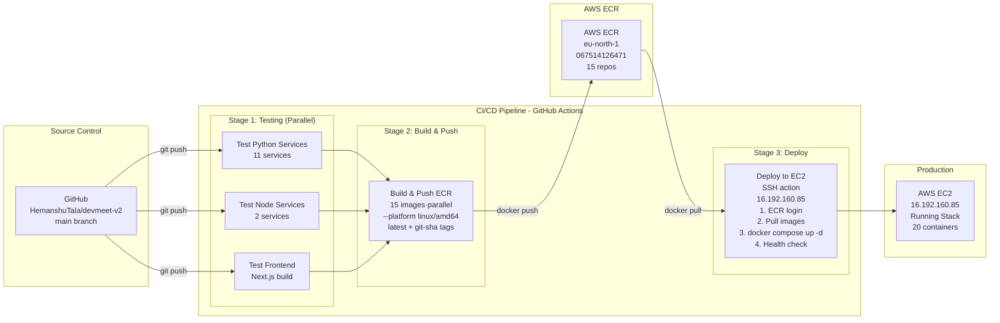

# 03 — AWS Infrastructure Architecture
**Document Number:** DevMeet-AWS-003  
**Version:** 2.0  
**Date:** 2026-08-02  
**Status:** Production  
**Classification:** Internal Technical  
**IEEE Standard Reference:** IEEE 1016-2009 (Software Design Description)

---

## 1. Infrastructure Overview

### 1.1 System Description

DevMeet v2.0 runs entirely on AWS in the **eu-north-1 (Stockholm)** region. The deployment uses a single EC2 instance running Docker Compose, with AWS managed services for storage, email, and container registry.

### 1.2 Infrastructure Diagram

```mermaid
graph TB
    subgraph "AWS Account: 067514126471<br/>Region: eu-north-1 (Stockholm)"
        subgraph "VPC: default<br/>CIDR: 172.31.0.0/16"
            subgraph "Subnet: eu-north-1c<br/>172.31.0.0/20"
                EC2[EC2: devmeet-prod<br/>c7i-flex.large<br/>Private: 172.31.1.102<br/>Public: 16.192.160.85<br/>OS: Amazon Linux 2023<br/>Storage: 50 GB gp3 EBS<br/>SG: launch-wizard-2<br/>Inbound: 22, 80, 443, 3000, 8000<br/>Docker Compose: 20 containers<br/>13 svc + 1 frontend + 6 infra]
            end
        end
        
        subgraph "AWS Managed Services"
            S3[AWS S3<br/>eu-north-1<br/>aakruti-s3<br/>Avatars·PDFs·Code snapshots]
            SES[AWS SES<br/>eu-north-1<br/>Sandbox→Production<br/>Transactional email]
            ECR[AWS ECR<br/>eu-north-1<br/>067514126471.dkr.ecr<br/>14 repositories]
        end
        
        subgraph "IAM"
            IAM[IAM User: hemanshu_tala<br/>ARN: arn:aws:iam::067514126471:user/hemanshu_tala<br/>Policies:<br/>• AmazonEC2ContainerRegistryFullAccess<br/>• AmazonEC2FullAccess<br/>• AmazonS3FullAccess<br/>• AmazonSESFullAccess<br/>• IAMUserChangePassword]
        end
    end
```

---

## 2. EC2 Instance

### 2.1 Instance Details

| Attribute | Value |
|-----------|-------|
| Instance ID | i-0b51b715a8889fc5d |
| Name | devmeet-prod |
| Instance Type | c7i-flex.large |
| vCPUs | 2 |
| Memory | 4 GB |
| Architecture | x86_64 |
| AMI | Amazon Linux 2023 (64-bit x86) |
| Region / AZ | eu-north-1 / eu-north-1c |
| Public IP | 16.192.160.85 (changes on stop/start) |
| Private IP | 172.31.1.102 (static within VPC) |
| Public DNS | ec2-16-192-160-85.eu-north-1.compute.amazonaws.com |
| Storage | 50 GB gp3 EBS (root volume) |
| Key Pair | devmeet-key (RSA, .pem) |

### 2.2 Security Group: launch-wizard-2

| Rule | Type | Protocol | Port | Source | Purpose |
|------|------|----------|------|--------|---------|
| Inbound | SSH | TCP | 22 | 0.0.0.0/0 | SSH access |
| Inbound | HTTP | TCP | 80 | 0.0.0.0/0 | API Gateway (NGINX) |
| Inbound | Custom | TCP | 443 | 0.0.0.0/0 | HTTPS (future TLS) |
| Inbound | Custom | TCP | 3000 | 0.0.0.0/0 | Frontend (Next.js) |
| Inbound | Custom | TCP | 8000 | 0.0.0.0/0 | API Gateway direct |
| Outbound | All | All | All | 0.0.0.0/0 | Allow all outbound |

### 2.3 Installed Software

| Software | Version | Purpose |
|----------|---------|---------|
| Amazon Linux 2023 | latest | OS |
| Docker Engine | 25.0.14 | Container runtime |
| Docker Compose | v2.24.6 | Multi-container orchestration |
| AWS CLI | v2.x | ECR authentication, S3 access |

### 2.4 Directory Structure on EC2

```
/opt/devmeet/
├── .env                          ← production environment variables
├── docker-compose.prod.yml       ← production compose file
└── migrations/
    └── init_dev_schema.sql       ← database schema
```

### 2.5 Docker Volumes (persistent data)

| Volume | Mount Path | Contains |
|--------|-----------|---------|
| `postgres_data` | `/var/lib/postgresql/data` | All database data |
| `redis_data` | `/data` | Redis RDB snapshots |
| `rabbitmq_data` | `/var/lib/rabbitmq` | Queue definitions + messages |
| `kafka_data` | `/var/lib/kafka/data` | Kafka topic logs |
| `zookeeper_data` | `/var/lib/zookeeper/data` | Kafka coordination |
| `elasticsearch_data` | `/usr/share/elasticsearch/data` | Search index |

---

## 3. AWS ECR (Container Registry)

### 3.1 Registry Details

| Attribute | Value |
|-----------|-------|
| Registry URI | `067514126471.dkr.ecr.eu-north-1.amazonaws.com` |
| Region | eu-north-1 |
| Encryption | AES256 |
| Image scanning | Enabled (scan on push) |

### 3.2 Repositories

| Repository Name | Service | Port | Runtime |
|----------------|---------|------|---------|
| `devmeet-auth-service` | Auth Service | 8001 | Python 3.11 |
| `devmeet-user-service` | User Service | 8002 | Python 3.11 |
| `devmeet-orchestrator-service` | Orchestrator | 8003 | Python 3.11 |
| `devmeet-ai-interviewer-service` | AI Interviewer | 8004 | Python 3.11 |
| `devmeet-code-execution-service` | Code Execution | 8005 | Python 3.11 |
| `devmeet-video-service` | Video Service | 8006 | Node.js 20 |
| `devmeet-feedback-service` | Feedback Service | 8007 | Python 3.11 |
| `devmeet-notification-service` | Notification | 8008 | Node.js 20 |
| `devmeet-analytics-service` | Analytics | 8009 | Python 3.11 |
| `devmeet-admin-service` | Admin Service | 8010 | Python 3.11 |
| `devmeet-file-service` | File Service | 8011 | Python 3.11 |
| `devmeet-payment-service` | Payment Service | 8012 | Python 3.11 |
| `devmeet-search-service` | Search Service | 8013 | Python 3.11 |
| `devmeet-api-gateway` | NGINX Gateway | 80/8000 | nginx:alpine |
| `devmeet-frontend` | Next.js Frontend | 3000 | Node.js 20 |

### 3.3 Image Tagging Strategy

| Tag | When created | Used for |
|-----|-------------|---------|
| `latest` | Every push to `main` | Production deployment |
| `{git-sha}` | Every push to `main` | Rollback reference |

### 3.4 Lifecycle Policy (applied to all repos)

```json
{
  "rules": [
    {
      "rulePriority": 1,
      "description": "Remove untagged images after 1 day",
      "selection": {
        "tagStatus": "untagged",
        "countType": "sinceImagePushed",
        "countUnit": "days",
        "countNumber": 1
      },
      "action": {"type": "expire"}
    },
    {
      "rulePriority": 2,
      "description": "Keep only last 10 tagged images",
      "selection": {
        "tagStatus": "tagged",
        "tagPrefixList": ["latest"],
        "countType": "imageCountMoreThan",
        "countNumber": 10
      },
      "action": {"type": "expire"}
    }
  ]
}
```

### 3.5 ECR Authentication

```bash
# Token expires every 12 hours — must re-authenticate before pull/push
aws ecr get-login-password --region eu-north-1 | \
  docker login --username AWS --password-stdin \
  067514126471.dkr.ecr.eu-north-1.amazonaws.com
```

---

## 4. AWS S3

### 4.1 Bucket Details

| Attribute | Value |
|-----------|-------|
| Bucket Name | `aakruti-s3` |
| Region | eu-north-1 |
| Access | Private (no public access) |
| Versioning | Disabled |
| Encryption | S3-Managed (SSE-S3) |

### 4.2 Object Key Structure

```
aakruti-s3/
├── avatars/
│   └── {user_id}/{timestamp}.webp        ← profile pictures
├── reports/
│   └── {session_id}/feedback.pdf         ← AI feedback PDF reports
├── code-snapshots/
│   └── {session_id}/{timestamp}_{lang}.json  ← code execution snapshots
└── uploads/
    └── {user_id}/{timestamp}_{filename}  ← user file uploads
```

### 4.3 Services Using S3

| Service | Operation | Key Prefix | Purpose |
|---------|-----------|-----------|---------|
| file-service | PUT, GET, DELETE | `avatars/`, `uploads/` | User file management |
| feedback-service | PUT | `reports/` | PDF report storage |
| code-execution-service | PUT | `code-snapshots/` | Code execution snapshots |

### 4.4 Access Method

All services use **boto3** with credentials from environment variables:
```
AWS_ACCESS_KEY_ID     = <REDACTED - use IAM role or GitHub Secret>
AWS_SECRET_ACCESS_KEY = (from .env)
AWS_REGION            = eu-north-1
S3_BUCKET             = aakruti-s3
```

Download access uses **presigned URLs** (15-minute TTL) — the browser downloads directly from S3 without the service being in the data path.

### 4.5 CORS Configuration

```json
{
  "CORSRules": [{
    "AllowedOrigins": ["*"],
    "AllowedHeaders": ["*"],
    "AllowedMethods": ["GET", "PUT", "POST", "DELETE", "HEAD"],
    "MaxAgeSeconds": 3000
  }]
}
```

---

## 5. AWS SES (Simple Email Service)

### 5.1 Configuration

| Attribute | Value |
|-----------|-------|
| Region | eu-north-1 |
| From Address | `hemansutala8@gmail.com` |
| Status | Sandbox (can only send to verified addresses) |
| Action Required | Submit production access request to send to anyone |

### 5.2 Email Templates

| Template | Trigger | Subject |
|----------|---------|---------|
| Welcome | `user.registered` RabbitMQ event | "Welcome to DevMeet!" |
| Feedback Ready | `feedback.generated` RabbitMQ event | "Your interview feedback is ready" |
| Password Reset | Auth Service forgot-password API | "Reset your DevMeet password" |

### 5.3 Sending Path

```
notification-service (Node.js)
  ↓ consumes RabbitMQ event
  ↓ builds email template
  ↓ calls AWS SDK: ses.sendEmail()
  → AWS SES eu-north-1
  → Recipient inbox
```

### 5.4 SES Sandbox Limitation

Currently in sandbox mode — emails can only be sent to **verified email addresses**. To send to all users:
1. Go to AWS SES Console → Account dashboard
2. Click "Request production access"
3. Fill in use case (transactional emails for mock interview platform)
4. AWS approves within 24–48 hours

---

## 6. IAM Configuration

### 6.1 IAM User: hemanshu_tala

| Attribute | Value |
|-----------|-------|
| ARN | `arn:aws:iam::067514126471:user/hemanshu_tala` |
| Console Access | Enabled (without MFA — should enable MFA) |
| Access Key | `<REDACTED>` (rotate immediately — was exposed in git history) |

### 6.2 Attached Policies

| Policy | Type | Purpose |
|--------|------|---------|
| `AmazonEC2ContainerRegistryFullAccess` | AWS Managed | Create/push/pull ECR repos |
| `AmazonEC2FullAccess` | AWS Managed | Launch/manage EC2 instances |
| `AmazonS3FullAccess` | AWS Managed | Full S3 bucket access |
| `AmazonSESFullAccess` | AWS Managed | Send emails via SES |
| `IAMUserChangePassword` | AWS Managed | Change own IAM password |
| `new_p` | Customer Inline | Custom policy (review contents) |

### 6.3 Security Recommendations

| Issue | Risk | Fix |
|-------|------|-----|
| No MFA on IAM user | High — account takeover risk | Enable MFA at IAM → Users → Security credentials |
| Access key 120 days old | Medium — rotate regularly | Rotate every 90 days |
| `AmazonEC2FullAccess` is broad | Medium | Scope to only required EC2 actions |
| `AmazonS3FullAccess` is broad | Medium | Scope to `aakruti-s3` bucket only |

---

## 7. CI/CD Pipeline

### 7.1 Pipeline Overview Diagram



### 7.2 GitHub Secrets Required

| Secret | Value / Purpose |
|--------|----------------|
| `AWS_ACCESS_KEY_ID` | Set in GitHub Secrets (do not hardcode) |
| `AWS_SECRET_ACCESS_KEY` | Set in GitHub Secrets (do not hardcode) |
| `AWS_ACCOUNT_ID` | `067514126471` |
| `EC2_HOST` | `16.192.160.85` |
| `EC2_SSH_KEY` | Contents of `devmeet-key.pem` |

### 7.3 Pipeline File

Location: `.github/workflows/ci-cd.yml`

Key configuration:
```yaml
on:
  push:
    branches: [main, develop]
  pull_request:
    branches: [main]

env:
  AWS_REGION: eu-north-1
  ECR_REGISTRY: 067514126471.dkr.ecr.eu-north-1.amazonaws.com
```

### 7.4 Build Arguments for Frontend

The frontend Next.js image is built with the EC2 IP baked in at build time:
```
NEXT_PUBLIC_GATEWAY_URL = http://16.192.160.85
NEXT_PUBLIC_API_URL     = http://16.192.160.85
NEXT_PUBLIC_NOTIF_WS_URL = ws://16.192.160.85
```

> **Note:** When the EC2 IP changes (stop/start), update `EC2_HOST` GitHub Secret and re-run the pipeline to rebuild the frontend image with the new IP.

---

## 8. Infrastructure Cost Estimate

### 8.1 Monthly Cost (eu-north-1)

| Resource | Type | Unit Cost | Est. Monthly |
|----------|------|-----------|-------------|
| EC2 `c7i-flex.large` | On-Demand Linux | $0.09/hr | ~$66 |
| EBS 50 GB gp3 | Storage | $0.0952/GB-mo | ~$5 |
| S3 `aakruti-s3` | ~10 GB + requests | ~$0.023/GB | ~$3 |
| SES emails | ~1,000/month | $0.10/1000 | ~$0.10 |
| ECR 15 repos | ~5 GB storage | $0.10/GB-mo | ~$0.50 |
| Data transfer out | ~20 GB | $0.09/GB | ~$2 |
| **Total** | | | **~$77/month** |

### 8.2 Scale-Up Path

| When | Action | New Monthly Cost |
|------|--------|----------------|
| > 50 concurrent users | Upgrade to `c7i-flex.xlarge` (8GB) | ~$130 |
| > 200 concurrent users | Upgrade to `c7i-flex.2xlarge` (16GB) | ~$250 |
| > 500 concurrent users | Migrate to EKS (3x t3.xlarge nodes) | ~$400 |
| > 5,000 concurrent users | EKS autoscaling + RDS + ElastiCache | ~$1,500 |

---

## 9. Disaster Recovery

### 9.1 Current Backup State

| Data | Backup Method | Recovery |
|------|--------------|---------|
| PostgreSQL | Docker volume on EBS | Restore from EBS snapshot |
| Redis | RDB snapshot every 1hr | Restart container (auto-loads RDB) |
| Elasticsearch | Docker volume on EBS | Restore from EBS snapshot |
| S3 files | AWS S3 (11 nines durability) | Never lost |
| Docker images | AWS ECR | Pull from ECR anytime |
| Code | GitHub | Clone from GitHub anytime |

### 9.2 Recovery Procedure

**EC2 instance failure:**
1. Launch new EC2 instance (same or larger type)
2. Attach existing EBS volume (if recoverable) OR start fresh
3. Install Docker + Docker Compose + AWS CLI
4. Run `aws ecr get-login-password | docker login`
5. Run `docker compose -f docker-compose.prod.yml up -d`
6. If new EBS: run DB migration `psql < init_dev_schema.sql`

**Time to recovery:** ~30 minutes

### 9.3 Recommended Improvements

- [ ] Enable EBS snapshots (automated daily via AWS Backup)
- [ ] Enable EC2 Auto Recovery (CloudWatch alarm → auto-recover on hardware failure)
- [ ] Use Elastic IP to keep a static public IP across stop/start
- [ ] Enable MFA on IAM user `hemanshu_tala`
- [ ] Move AWS credentials to EC2 Instance Role (eliminate long-lived access keys)
