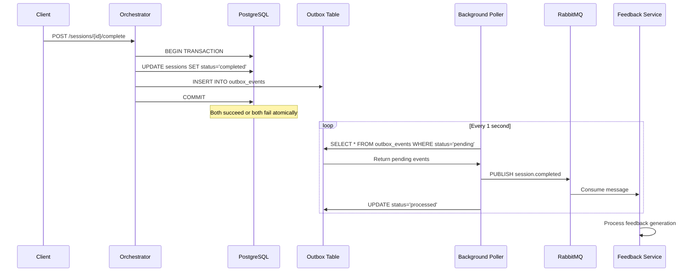

# 04 — Database Architecture
**Document Number:** DevMeet-DB-004  
**Version:** 2.0  
**Date:** 2026-08-02  
**Status:** Production  
**Classification:** Internal Technical  
**IEEE Standard Reference:** IEEE 1016-2009 (Software Design Description)

---

## 1. Database Layer Overview

### 1.1 System Description

DevMeet uses **five distinct storage systems**, each chosen for a specific workload. All run as Docker containers on the EC2 instance within the `devmeet_net` bridge network.

### 1.2 Data Layer Architecture Diagram

```mermaid
graph TB
    subgraph "DevMeet Data Layer"
        subgraph "Relational Database"
            PG[PostgreSQL 16<br/>devmeet-postgres-1<br/>:5432<br/>Volume: postgres_data<br/>Primary relational store<br/>ACID·Business data<br/>Owned by: Auth·User·Orchestrator<br/>Feedback·Analytics·Admin·Payment]
        end
        
        subgraph "Cache & Search"
            REDIS[Redis 7.2<br/>redis-1<br/>:6379<br/>Volume: redis_data<br/>JWT·rate-limit<br/>Pub/Sub·quota]
            ES[Elasticsearch 8.11<br/>elastic-1<br/>:9200<br/>Volume: elastic_data<br/>Question bank index<br/>Full-text search]
        end
        
        subgraph "Message Brokers"
            RMQ[RabbitMQ 3.12<br/>mq-1<br/>:5672<br/>Volume: rabbitmq_data<br/>Task queues<br/>Reliable delivery]
            KAFKA[Kafka 3.6<br/>kafka-1<br/>:9092<br/>Volume: kafka_data<br/>+ Zookeeper :2181<br/>Analytics events<br/>Replayable log]
        end
        
        subgraph "Object Storage"
            S3[AWS S3<br/><YOUR_S3_BUCKET_NAME><br/>eu-north-1<br/>External (not containerised)<br/>Avatars·PDF reports<br/>Code snapshots·File uploads]
        end
    end
```

---

## 2. PostgreSQL Schema

### 2.1 Complete Table Reference

```sql
-- ─── USERS & AUTH ──────────────────────────────────────────────────────────

CREATE TABLE users (
    id              UUID         PRIMARY KEY DEFAULT gen_random_uuid(),
    email           VARCHAR(255) UNIQUE NOT NULL,
    password_hash   VARCHAR(255),          -- NULL for OAuth-only users
    full_name       VARCHAR(255),
    role            VARCHAR(20)  NOT NULL DEFAULT 'user',
                                           -- 'user' | 'admin'
    is_active       BOOLEAN      NOT NULL DEFAULT TRUE,
    is_verified     BOOLEAN      NOT NULL DEFAULT FALSE,
    created_at      TIMESTAMPTZ  NOT NULL DEFAULT NOW(),
    updated_at      TIMESTAMPTZ  NOT NULL DEFAULT NOW(),
    deleted_at      TIMESTAMPTZ                             -- soft delete
);

CREATE TABLE user_profiles (
    user_id         UUID         PRIMARY KEY REFERENCES users(id) ON DELETE CASCADE,
    avatar_url      VARCHAR(500),
    bio             TEXT,
    github_url      VARCHAR(255),
    linkedin_url    VARCHAR(255),
    target_role     VARCHAR(100),          -- 'frontend' | 'backend' | 'fullstack' etc
    experience_years INT,
    preferred_language VARCHAR(50),
    timezone        VARCHAR(100),
    updated_at      TIMESTAMPTZ  NOT NULL DEFAULT NOW()
);

CREATE TABLE user_plans (
    user_id         UUID         PRIMARY KEY REFERENCES users(id) ON DELETE CASCADE,
    plan            VARCHAR(20)  NOT NULL DEFAULT 'free',
                                           -- 'free' | 'pro' | 'enterprise'
    started_at      TIMESTAMPTZ  NOT NULL DEFAULT NOW(),
    expires_at      TIMESTAMPTZ,           -- NULL = never expires
    updated_at      TIMESTAMPTZ  NOT NULL DEFAULT NOW()
);

CREATE TABLE usage_quotas (
    id              UUID         PRIMARY KEY DEFAULT gen_random_uuid(),
    user_id         UUID         NOT NULL REFERENCES users(id) ON DELETE CASCADE,
    date            DATE         NOT NULL,
    daily_count     INT          NOT NULL DEFAULT 0,
    monthly_count   INT          NOT NULL DEFAULT 0,
    UNIQUE(user_id, date)
);

CREATE TABLE mfa_configs (
    user_id         UUID         PRIMARY KEY REFERENCES users(id) ON DELETE CASCADE,
    totp_secret     VARCHAR(255) NOT NULL,
    is_enabled      BOOLEAN      NOT NULL DEFAULT FALSE,
    backup_codes    TEXT[],
    created_at      TIMESTAMPTZ  NOT NULL DEFAULT NOW()
);

CREATE TABLE oauth_accounts (
    id              UUID         PRIMARY KEY DEFAULT gen_random_uuid(),
    user_id         UUID         NOT NULL REFERENCES users(id) ON DELETE CASCADE,
    provider        VARCHAR(50)  NOT NULL,  -- 'google' | 'github'
    provider_user_id VARCHAR(255) NOT NULL,
    access_token    TEXT,
    refresh_token   TEXT,
    created_at      TIMESTAMPTZ  NOT NULL DEFAULT NOW(),
    UNIQUE(provider, provider_user_id)
);

CREATE TABLE login_history (
    id              BIGSERIAL    PRIMARY KEY,
    user_id         UUID         REFERENCES users(id) ON DELETE SET NULL,
    ip_address      VARCHAR(45),
    user_agent      TEXT,
    login_at        TIMESTAMPTZ  NOT NULL DEFAULT NOW(),
    success         BOOLEAN      NOT NULL,
    failure_reason  VARCHAR(100)
);

CREATE TABLE login_attempts (
    ip_address      VARCHAR(45)  PRIMARY KEY,
    attempt_count   INT          NOT NULL DEFAULT 0,
    last_attempt_at TIMESTAMPTZ,
    locked_until    TIMESTAMPTZ
);

CREATE TABLE password_resets (
    id              UUID         PRIMARY KEY DEFAULT gen_random_uuid(),
    user_id         UUID         NOT NULL REFERENCES users(id) ON DELETE CASCADE,
    token_hash      VARCHAR(255) NOT NULL UNIQUE,
    expires_at      TIMESTAMPTZ  NOT NULL,
    used_at         TIMESTAMPTZ,
    created_at      TIMESTAMPTZ  NOT NULL DEFAULT NOW()
);

-- ─── SESSIONS & INTERVIEWS ─────────────────────────────────────────────────

CREATE TABLE sessions (
    id              UUID         PRIMARY KEY DEFAULT gen_random_uuid(),
    user_id         UUID         NOT NULL REFERENCES users(id) ON DELETE CASCADE,
    interview_type  VARCHAR(50)  NOT NULL,  -- 'dsa' | 'behavioral' | 'system_design'
    difficulty      VARCHAR(20)  NOT NULL,  -- 'easy' | 'medium' | 'hard'
    status          VARCHAR(20)  NOT NULL DEFAULT 'pending',
                                            -- pending|in_progress|paused|completed|cancelled
    topic           VARCHAR(255),
    language        VARCHAR(50),            -- programming language chosen
    duration_minutes INT,
    started_at      TIMESTAMPTZ,
    completed_at    TIMESTAMPTZ,
    last_heartbeat_at TIMESTAMPTZ,
    feedback_status VARCHAR(20)  DEFAULT 'pending',
                                            -- pending|processing|completed|failed
    recording_consent BOOLEAN    NOT NULL DEFAULT FALSE,
    created_at      TIMESTAMPTZ  NOT NULL DEFAULT NOW()
);

CREATE TABLE conversation_turns (
    id              BIGSERIAL    PRIMARY KEY,
    session_id      UUID         NOT NULL REFERENCES sessions(id) ON DELETE CASCADE,
    turn_number     INT          NOT NULL,
    role            VARCHAR(20)  NOT NULL,  -- 'user' | 'assistant'
    content         TEXT         NOT NULL,
    token_count     INT,
    created_at      TIMESTAMPTZ  NOT NULL DEFAULT NOW(),
    UNIQUE(session_id, turn_number)
);

CREATE TABLE code_submissions (
    id              UUID         PRIMARY KEY DEFAULT gen_random_uuid(),
    session_id      UUID         NOT NULL REFERENCES sessions(id) ON DELETE CASCADE,
    language        VARCHAR(50)  NOT NULL,
    code            TEXT         NOT NULL,
    test_cases_passed INT,
    test_cases_total INT,
    execution_time_ms INT,
    submitted_at    TIMESTAMPTZ  NOT NULL DEFAULT NOW()
);

-- ─── FEEDBACK ──────────────────────────────────────────────────────────────

CREATE TABLE feedback_reports (
    id              UUID         PRIMARY KEY DEFAULT gen_random_uuid(),
    session_id      UUID         NOT NULL UNIQUE REFERENCES sessions(id) ON DELETE CASCADE,
    user_id         UUID         NOT NULL REFERENCES users(id) ON DELETE CASCADE,

    -- Six scored dimensions (0.0–10.0 each)
    technical_accuracy    DECIMAL(4,1),
    problem_solving       DECIMAL(4,1),
    code_quality          DECIMAL(4,1),
    communication         DECIMAL(4,1),
    time_management       DECIMAL(4,1),
    overall_score         DECIMAL(4,1),

    -- AI-generated text feedback
    summary              TEXT,
    strengths            TEXT[],
    improvements         TEXT[],
    detailed_feedback    JSONB,

    -- PDF stored in S3
    pdf_url              VARCHAR(500),    -- s3://<YOUR_S3_BUCKET_NAME>/reports/{session_id}.pdf

    generated_at         TIMESTAMPTZ,
    created_at           TIMESTAMPTZ  NOT NULL DEFAULT NOW()
);

-- ─── PAYMENTS ──────────────────────────────────────────────────────────────

CREATE TABLE subscriptions (
    id              UUID         PRIMARY KEY DEFAULT gen_random_uuid(),
    user_id         UUID         NOT NULL REFERENCES users(id) ON DELETE CASCADE,
    plan            VARCHAR(20)  NOT NULL,
    provider        VARCHAR(20)  NOT NULL DEFAULT 'razorpay',
    provider_subscription_id VARCHAR(255),
    status          VARCHAR(20)  NOT NULL DEFAULT 'active',
    current_period_start TIMESTAMPTZ,
    current_period_end   TIMESTAMPTZ,
    cancel_at_period_end BOOLEAN NOT NULL DEFAULT FALSE,
    created_at      TIMESTAMPTZ  NOT NULL DEFAULT NOW()
);

CREATE TABLE billing_events (
    id              UUID         PRIMARY KEY DEFAULT gen_random_uuid(),
    user_id         UUID         REFERENCES users(id) ON DELETE SET NULL,
    event_type      VARCHAR(50)  NOT NULL,   -- 'payment.captured' | 'subscription.cancelled'
    provider        VARCHAR(20)  NOT NULL,
    provider_event_id VARCHAR(255),
    amount          INT,                     -- in smallest currency unit (paise)
    currency        VARCHAR(3),
    metadata        JSONB,
    created_at      TIMESTAMPTZ  NOT NULL DEFAULT NOW()
);

-- ─── ANALYTICS ─────────────────────────────────────────────────────────────

CREATE TABLE analytics_events (
    id              BIGSERIAL    PRIMARY KEY,
    event_type      VARCHAR(50)  NOT NULL,
    user_id         VARCHAR(100),           -- VARCHAR for anonymised events
    session_id      VARCHAR(100),
    properties      JSONB,
    ip_address      VARCHAR(45),
    created_at      TIMESTAMPTZ  NOT NULL DEFAULT NOW()
) PARTITION BY RANGE (created_at);

-- Monthly partitions (example — created by automated job):
CREATE TABLE analytics_events_2026_08
    PARTITION OF analytics_events
    FOR VALUES FROM ('2026-08-01') TO ('2026-09-01');

-- ─── AUDIT ─────────────────────────────────────────────────────────────────

CREATE TABLE audit_logs (
    id              BIGSERIAL    PRIMARY KEY,
    user_id         UUID         REFERENCES users(id) ON DELETE SET NULL,
    action          VARCHAR(100) NOT NULL,
    resource_type   VARCHAR(50),
    resource_id     VARCHAR(100),
    details         JSONB,
    ip_address      VARCHAR(45),
    created_at      TIMESTAMPTZ  NOT NULL DEFAULT NOW()
);

-- ─── OUTBOX (Transactional Outbox Pattern) ─────────────────────────────────

CREATE TABLE outbox_events (
    id              UUID         PRIMARY KEY DEFAULT gen_random_uuid(),
    event_type      VARCHAR(100) NOT NULL,
    payload         JSONB        NOT NULL,
    status          VARCHAR(20)  NOT NULL DEFAULT 'pending',
    created_at      TIMESTAMPTZ  NOT NULL DEFAULT NOW(),
    processed_at    TIMESTAMPTZ
);
```

### 2.2 Index Strategy

```sql
-- ─── Auth indexes ───────────────────────────────────
CREATE UNIQUE INDEX idx_users_email         ON users(email);
CREATE INDEX idx_users_role                 ON users(role);
CREATE INDEX idx_login_history_user_id      ON login_history(user_id, login_at DESC);
CREATE INDEX idx_password_resets_token      ON password_resets(token_hash);

-- ─── Session indexes ────────────────────────────────
CREATE INDEX idx_sessions_user_id           ON sessions(user_id, created_at DESC);
CREATE INDEX idx_sessions_status            ON sessions(status);
CREATE INDEX idx_sessions_heartbeat         ON sessions(last_heartbeat_at)
    WHERE status = 'in_progress';           -- partial index for heartbeat monitor
CREATE INDEX idx_turns_session_id           ON conversation_turns(session_id, turn_number);
CREATE INDEX idx_code_submissions_session   ON code_submissions(session_id, submitted_at DESC);

-- ─── Feedback indexes ───────────────────────────────
CREATE UNIQUE INDEX idx_feedback_session_id ON feedback_reports(session_id);
CREATE INDEX idx_feedback_user_id           ON feedback_reports(user_id, created_at DESC);

-- ─── Analytics indexes ──────────────────────────────
CREATE INDEX idx_analytics_user_type        ON analytics_events(user_id, event_type);
CREATE INDEX idx_analytics_session         ON analytics_events(session_id);
-- Note: created_at index is provided by the partition range

-- ─── Outbox index ────────────────────────────────────
CREATE INDEX idx_outbox_pending             ON outbox_events(created_at)
    WHERE status = 'pending';               -- partial index — only pending rows
```

---

## 3. Redis

### 3.1 Configuration

```
Container: devmeet-redis-1
Port:      6379
Version:   7.2-alpine
maxmemory: 256mb
maxmemory-policy: allkeys-lru
```

### 3.2 Key Schema

| Key Pattern | Type | TTL | Set by | Used by | Purpose |
|-------------|------|-----|--------|---------|---------|
| `refresh:{token_hash}` | String (user_id) | 7 days | Auth Service on login | Auth Service on token refresh | Refresh token validation |
| `ratelimit:{ip}:login` | Counter | 60 seconds | Auth Service | Auth Service | Login rate limiting (5/min) |
| `ratelimit:{ip}:api` | Counter | 1 second | NGINX | NGINX | General API rate limiting |
| `mfa_pending:{user_id}` | String (state JSON) | 10 minutes | Auth Service | Auth Service | MFA login flow |
| `quota:{user_id}` | String (count JSON) | Until midnight | User Service | User Service | Session quota cache |
| `notif:{user_id}` | Pub/Sub channel | N/A | Notification Service | Notification Service | WebSocket message fanout |
| `session_cache:{id}` | String (JSON) | 5 minutes | Orchestrator | Orchestrator | Hot session data cache |

### 3.3 Redis Pub/Sub for WebSocket

```
Problem: Notification Service runs as 1 pod.
         User's WebSocket connection is to that pod.
         Any service can publish a notification.

Solution:
  Publisher (any service):
    PUBLISH notif:{user_id} {json_payload}

  Subscriber (Notification Service pod):
    SUBSCRIBE notif:{user_id}  ← when user connects via WS
    On message received → forward to user's WS connection
    UNSUBSCRIBE notif:{user_id} ← when user disconnects
```

---

## 4. Elasticsearch

### 4.1 Configuration

```
Container: devmeet-elasticsearch-1
Port:      9200
Version:   8.11.0
Heap:      512MB min, 1GB max (set via ES_JAVA_OPTS)
Security:  xpack.security.enabled=false (internal network only)
Discovery: single-node
vm.max_map_count: 262144 (required on EC2 host — set via sysctl)
```

### 4.2 Index: `devmeet_questions`

```json
{
  "settings": {
    "number_of_shards": 1,
    "number_of_replicas": 0,
    "analysis": {
      "analyzer": {
        "english_analyzer": {
          "type": "english"
        }
      }
    }
  },
  "mappings": {
    "properties": {
      "id":             {"type": "keyword"},
      "title":          {"type": "text", "analyzer": "english"},
      "body":           {"type": "text", "analyzer": "english"},
      "interview_type": {"type": "keyword"},
      "difficulty":     {"type": "keyword"},
      "tags":           {"type": "keyword"},
      "companies":      {"type": "keyword"},
      "created_at":     {"type": "date"},
      "updated_at":     {"type": "date"}
    }
  }
}
```

### 4.3 Sample Search Query

```json
GET /devmeet_questions/_search
{
  "query": {
    "bool": {
      "must": {
        "multi_match": {
          "query": "binary tree traversal",
          "fields": ["title^2", "body", "tags"],
          "fuzziness": "AUTO"
        }
      },
      "filter": [
        {"term": {"interview_type": "dsa"}},
        {"term": {"difficulty": "medium"}}
      ]
    }
  },
  "sort": [{"_score": "desc"}],
  "size": 10
}
```

---

## 5. RabbitMQ

### 5.1 Configuration

```
Container: devmeet-rabbitmq-1
Port:      5672 (AMQP), 15672 (Management UI)
Version:   3.12-management
Default user: guest / guest
```

### 5.2 Exchange and Queue Definitions

```
Exchange: devmeet.events  (type: topic, durable: true)

Queues:
  feedback.generate
    binding key: session.completed
    consumer:    feedback-service
    durable:     true
    arguments:   x-dead-letter-exchange: devmeet.dlx
                 x-message-ttl: 3600000  (1 hour)

  notification.feedback
    binding key: feedback.generated
    consumer:    notification-service
    durable:     true

  notification.welcome
    binding key: user.registered
    consumer:    notification-service
    durable:     true

Dead Letter Exchange: devmeet.dlx
  Queue: devmeet.dlq  (inspect manually for failed messages)
```

### 5.3 Message Flow

```
Orchestrator
  PUBLISH exchange=devmeet.events  routing_key=session.completed
    payload: {
      "session_id": "uuid",
      "user_id": "uuid",
      "interview_type": "dsa",
      "completed_at": "2026-08-02T12:00:00Z"
    }
  ↓
  → feedback.generate queue
  → Feedback Service consumes, ACKs after PDF generated
  → Feedback Service PUBLISHes routing_key=feedback.generated
    payload: {
      "session_id": "uuid",
      "user_id": "uuid",
      "user_email": "user@example.com",
      "pdf_url": "https://s3.eu-north-1.amazonaws.com/<YOUR_S3_BUCKET_NAME>/reports/..."
    }
  → notification.feedback queue
  → Notification Service consumes
  → Sends email via SES + WebSocket push
```

---

## 6. Kafka

### 6.1 Configuration

```
Container:  devmeet-kafka-1 (+ devmeet-zookeeper-1)
Port:       9092 (Kafka), 2181 (Zookeeper)
Version:    confluentinc/cp-kafka:7.5.0
Broker ID:  1
Listeners:  PLAINTEXT://kafka:9092
Replication factor: 1 (single broker)
Auto-create topics: enabled
```

### 6.2 Topics

| Topic | Producer | Consumer Group | Partitions | Retention |
|-------|---------|---------------|-----------|---------|
| `analytics.events` | Orchestrator | `analytics-service` | 1 | 7 days |
| `audit.actions` | Auth, Admin | `analytics-service` | 1 | 30 days |

### 6.3 Analytics Event Schema

```json
{
  "event_type": "session.completed",
  "user_id": "uuid",
  "session_id": "uuid",
  "timestamp": "2026-08-02T12:00:00Z",
  "properties": {
    "interview_type": "dsa",
    "difficulty": "medium",
    "duration_minutes": 45,
    "overall_score": 7.5
  }
}
```

### 6.4 Why Kafka Alongside RabbitMQ

| | RabbitMQ | Kafka |
|---|---------|-------|
| **Used for** | Feedback + notification tasks | Analytics event stream |
| **Message lifetime** | Until consumed + ACKed | 7–30 days (replayable) |
| **Delivery guarantee** | Exactly-once (with confirms + ACK) | At-least-once (consumer offset) |
| **Multiple consumers** | One consumer per queue | Multiple consumer groups, same log |
| **Re-processing** | Not possible after ACK | Consumer can reset offset and replay |
| **Use case fit** | Task queues (do X once reliably) | Event log (replay, audit, fan-out) |

---

## 7. AWS S3 as Data Store

### 7.1 Why S3 Instead of PostgreSQL bytea

| Factor | PostgreSQL bytea | AWS S3 |
|--------|----------------|--------|
| Cost per GB | ~$0.10/GB (SSD EBS) | ~$0.023/GB |
| Backup size | Inflates pg_dump significantly | Independent of DB backup |
| Streaming to browser | Through service (wastes connection) | Presigned URL (direct download) |
| File size limit | 1 GB practical max | 5 TB per object |
| CDN integration | Not possible | S3 + CloudFront (future) |

### 7.2 Access Patterns

| Operation | Method | Who initiates |
|-----------|--------|--------------|
| Upload file | `boto3.put_object()` | file-service, feedback-service |
| Download file | `boto3.generate_presigned_url()` 15min TTL | file-service → browser downloads direct |
| Delete file | `boto3.delete_object()` | file-service on user delete |
| List objects | `boto3.list_objects_v2()` | admin-service (audit) |

---

## 8. Transactional Outbox Pattern

### 8.1 Problem Statement

```
Orchestrator needs to:
  1. UPDATE sessions SET status='completed'   ← PostgreSQL
  2. PUBLISH session.completed                ← RabbitMQ

These are two different systems.
If step 1 succeeds and step 2 fails → feedback never generated.
If step 2 succeeds and step 1 fails → feedback generated for non-existent session.
```

### 8.2 Solution Diagram



---

## 9. Data Retention Policy

| Table / Store | Retention | Mechanism |
|---------------|-----------|----------|
| `analytics_events` | 12 months online | Monthly partition detach + S3 archive + DROP |
| `audit_logs` | 90 days online, 2 years cold | Nightly job → S3 JSON dump → DELETE |
| `login_history` | 90 days | Nightly DELETE WHERE login_at < NOW()-90d |
| `login_attempts` | 24h after unlock | Nightly DELETE |
| `password_resets` | 24h after expiry | Nightly DELETE |
| `outbox_events` | 7 days after processed | Nightly DELETE WHERE processed |
| `sessions` | Indefinite | Cascade deleted with user |
| `billing_events` | 7 years (legal) | Never deleted; S3 Glacier after 2 years |
| S3 `reports/` | Indefinite | Deleted with user account |
| S3 `code-snapshots/` | 90 days | S3 Lifecycle rule |
| Redis keys | Per TTL | Automatic expiry |
| Kafka topics | 7–30 days | Topic retention config |

---

## 10. Decision Summary

| Decision | Choice | Rationale |
|----------|--------|-----------|
| Primary database | PostgreSQL 16 | ACID, strong relational model, JSONB for flexible fields |
| Single DB vs per-service | Shared single DB | Acceptable at current scale; logical table ownership per service |
| Scaling approach | Vertical first | Read replicas at 500 DAU; partitioning at 50M rows |
| Session cache | Redis | Sub-millisecond JWT validation on every request |
| Search engine | Elasticsearch | Full-text BM25, fuzzy, filter |
| File storage | AWS S3 `<YOUR_S3_BUCKET_NAME>` | Cost, streaming, presigned URLs — no benefit to bytea |
| Task queue | RabbitMQ | Exactly-once delivery, DLQ, per-message TTL |
| Event stream | Kafka | Replayable log, multiple consumer groups, analytics fan-out |
| Two brokers | RabbitMQ + Kafka | Different guarantees needed for different use cases |
| Outbox pattern | DB outbox table + poller | Atomic write + publish; no dual-write race condition |
| Sharding | Not yet | Volume does not warrant it; partitioning covers it |
